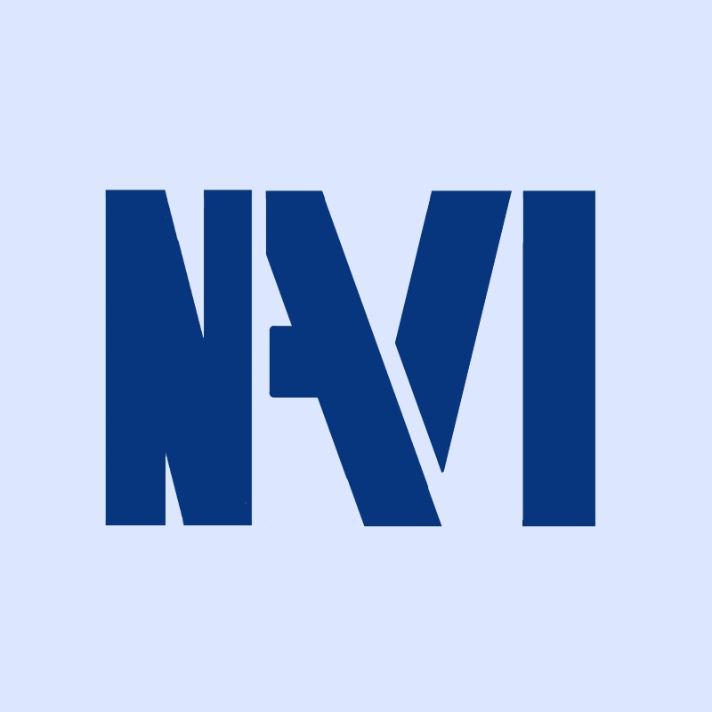

<h1 align="center">NAVI</h1>
 

 <h1>Our inspiration</h1>
 
We wanted to make a game that is different compared to all the others. We wanted to make it an 8bit-style(similar to UNDERTALE) experience.

 <h1>Goal</h1>
 
Our team's goal is to satisfy our players' entertainment needs while learning at the same time.

 <h1>Programs used</h1>
 FireAlpaca - Drawing software for designs.  
  Visual Studio 2022 - For C++ coding.  
 Git - For commiting changes.
 <h1>Team members</h1>
 
Dimitar Harizanov 9G- Scum trainer 

  
Nikolay Nizunov 9V- Front-end dev 

    
Rumen Spasov 9V- Back-end dev 

  
Martin Yanev 9B- designer

